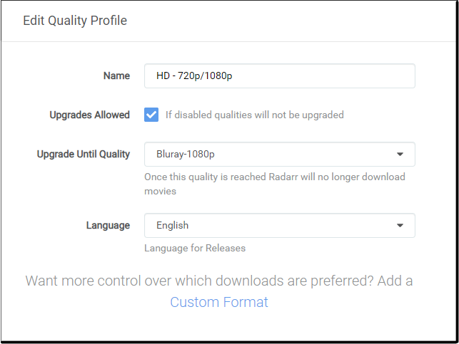
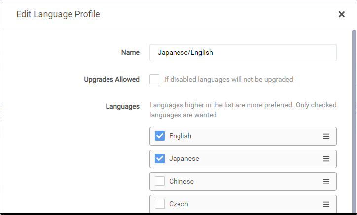

# About
A [Docker Mod](https://github.com/linuxserver/docker-mods) for the LinuxServer.io Radarr/Sonarr v3 Docker container that adds a script to automatically strip out unwanted audio and subtitle streams, keeping only the desired languages.

**Beginning with version 2.0 of this mod, it only supports v3 or later of Radarr/Sonarr.  For legacy Radarr/Sonarr v2 please use mod release 1.3 or earlier**

**This unified script works in both Radarr and Sonarr.  Use this mod in either container!**
>**NOTE:** This mod supports Linux OSes only.

Container info:

  
Production Container info: 

# Installation
1. Pull your selected container ([linuxserver/radarr](https://hub.docker.com/r/linuxserver/radarr "LinuxServer.io's Radarr container") or [linuxserver/sonarr](https://hub.docker.com/r/linuxserver/sonarr "LinuxServer.io's Sonarr container")) from Docker Hub:  
  `docker pull linuxserver/radarr:latest`   OR  
  `docker pull linuxserver/sonarr:latest`   

2. Configure the Docker container with all the port, volume, and environment settings from the *original container documentation* here:  
   **[linuxserver/radarr](https://hub.docker.com/r/linuxserver/radarr "Radarr Docker container")**  
   **[linuxserver/sonarr](https://hub.docker.com/r/linuxserver/sonarr "Sonarr Docker container")**
   1. Add the **DOCKER_MODS** environment variable to the `docker run` command, as follows:  
      - Dev/test release: `-e DOCKER_MODS=thecaptain989/radarr-striptracks:latest`  
      - Stable release: `-e DOCKER_MODS=linuxserver/mods:radarr-striptracks`

      *Example Docker CLI Configuration*  
       ```shell
       docker run -d \
         --name=radarr \
         -e PUID=1000 \
         -e PGID=1000 \
         -e TZ=America/Chicago \
         -e DOCKER_MODS=linuxserver/mods:radarr-striptracks \
         -p 7878:7878 \
         -v /path/to/data:/config \
         -v /path/to/movies:/movies \
         -v /path/to/downloadclient-downloads:/downloads \
         --restart unless-stopped \
         ghcr.io/linuxserver/radarr
       ```   

      *Example Synology Configuration*  
      

   2. Start the container.

3. Configure a custom script from Radarr's or Sonarr's *Settings* > *Connect* screen and type the following in the **Path** field:  
   `/usr/local/bin/striptracks.sh`  

   *Example*  
   

   The script will detect the language defined in the video profile for the movie or TV show and only keep the audio and subtitles selected.  
   Alternatively, a wrapper script may be used to more granularly define which tracks to keep.  See [wrapper scripts](./README.md#wrapper-scripts) for more details.

## Usage
The source video can be any mkvtoolnix supported video format. The output is an MKV file with the same name.  
Chapters, if they exist, are preserved. The Title attribute in the MKV is set to the movie title plus year  
(ex: `The Sting (1973)`) or the series title plus episode information (ex: `Happy! 01x01 - What Smiles Are For`).

If you've configured the Radarr/Sonarr **Recycle Bin** path correctly, the original video will be moved there.  
![danger] **NOTE:** If you have *not* configured the Recycle Bin, the original video file will be deleted/overwritten and permanently lost.

### Syntax
Beginning with version 2.0 of this mod, the script may be called with no arguments.  In this configuration it will detect the language(s) defined in the profile (Quality Profile for Radarr, Language Profile for Sonarr) configured on the particular movie or TV show.  

#### Automatic Language Detection
Both audio and subtitles that match the selected language(s) are kept.

*Radarr Quality Profile Example*  


*Sonarr Language Profile Example*  


>**Note:** The intent of the Radarr language selection 'Original' is not well documented.  For the purposes of this script, it has the same function as 'Any' and will preserve all languages in the video file.

#### Manual Override
The script still supports command line arguments that will override what is detected.  More granular control can therefore be exerted or extended using tagging and defining multiple Connect scripts (this is native Radarr/Sonarr functionality outside the scope of this documentation).

The script accepts two command line arguments and one option:

`[-d] [<audio_languages> [<subtitle_languages>]]`

The `<audio_languages>` and `<subtitle_languages>` are optional arguments that are colon (:) prepended language codes in [ISO639-2](https://en.wikipedia.org/wiki/List_of_ISO_639-2_codes "List of ISO 639-2 codes") format.  
For example:

* :eng
* :fre
* :spa

...etc.

Multiple codes may be concatenated, such as `:eng:spa` for both English and Spanish.  

>**NOTE:** The script is smart enough to not remove the last audio track. This way you don't have to specify every possible language if you are importing a
foreign film, for example.

The `-d` option enables debug logging.

### Examples
```
:eng:und :eng            # keep English and Undetermined audio and English subtitles
-d :eng ""               # Enable debugging, keeping English audio and no subtitles
:eng:kor:jpn :eng:spa    # Keep English, Korean, and Japanese audio, and English and
                         # Spanish subtitles
```

### Wrapper Scripts
To supply arguments to the script, one of the included wrapper scripts may be used or a custom wrapper script must be created.

#### Included Wrapper Scripts
For your convenience, several wrapper scripts are included in the `/usr/local/bin/` directory.  
You may use any of these scripts in place of `striptracks.sh` mentioned in the [Installation](./README.md#installation) section above.

```
striptracks-debug.sh       # Use detected languages, but enable debug logging
striptracks-dut.sh         # Keep Dutch audio and subtitles
striptracks-eng.sh         # Keep English and Undetermined audio and English subtitles
striptracks-eng-debug.sh   # Keep English and Undetermined audio and English subtitles, and enable debug logging
striptracks-eng-fre.sh     # Keep English, French, and Undetermined audio and English subtitles
striptracks-eng-jpn.sh     # Keep English, Japanese, and Undetermined audio and English subtitles
striptracks-fre.sh         # Keep French audio and subtitles
striptracks-fre-debug.sh   # Keep French audio and subtitles, and enable debug logging
striptracks-ger.sh         # Keep German audio and subtitles
striptracks-spa.sh         # Keep Spanish audio and subtitles
```

#### Example Wrapper Script
To configure the last entry from the [Examples](./README.md#examples) section above, create and save a file called `striptracks-custom.sh` to `/config` containing the following text:
```shell
#!/bin/bash

. /usr/local/bin/striptracks.sh :eng:kor:jpn :eng:spa
```
Make it executable:
```shell
chmod +x /config/striptracks-custom.sh
```

Then put `/config/striptracks-custom.sh` in the **Path** field in place of `/usr/local/bin/striptracks.sh` mentioned in the [Installation](./README.md#installation) section above.

>**Note:** If you followed the Linuxserver.io recommendations when configuring your container, the `/config` directory will be mapped to an external storage location.  It is therefore recommended to place custom scripts in the `/config` directory so they will survive container updates, but they may be placed anywhere that is accessible by Radarr or Sonarr.

### Triggers
The only events/notification triggers that have been tested are **On Import** and **On Upgrade**

### Logs
A log file is created for the script activity called:

`/config/logs/striptracks.txt`

This log can be inspected or downloaded from Radarr/Sonarr under *System* > *Logs* > *Files*

Script errors will show up in both the script log and the native Radarr/Sonarr log.

Log rotation is performed with 5 log files of 512KB each being kept.  
>![danger] **NOTE:** If debug logging is enabled, the log file can grow very large very quickly.  *Do not leave debug logging enabled permanently.*

___

# Credits

This would not be possible without the following:

[Radarr](http://radarr.video/ "Radarr homepage")  
[Sonarr](http://sonarr.tv/ "Sonarr homepage")  
[LinuxServer.io Radarr](https://hub.docker.com/r/linuxserver/radarr "Radarr Docker container") container  
[LinuxServer.io Sonarr](https://hub.docker.com/r/linuxserver/sonarr "Sonarr Docker container") container  
[LinuxServer.io Docker Mods](https://hub.docker.com/r/linuxserver/mods "Docker Mods containers") project  
[MKVToolNix](https://mkvtoolnix.download/ "MKVToolNix homepage") by Moritz Bunkus  
The AWK script parsing mkvmerge output is adapted from Endoro's post on [VideoHelp](https://forum.videohelp.com/threads/343271-BULK-remove-non-English-tracks-from-MKV-container#post2292889).  
Icons made by [Freepik](https://www.freepik.com) from [Flaticon](https://www.flaticon.com/)

[warning]: .assets/warning.png "Warning"
[danger]: .assets/danger.png "Danger"
